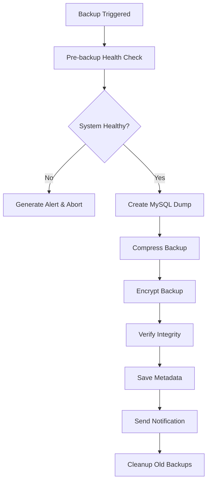

# PharmaTraK Backup & Disaster Recovery System

## 🚀 Overview

The PharmaTraK Backup & Disaster Recovery System provides comprehensive data protection and system monitoring capabilities designed specifically for pharmacy operations. This system ensures business continuity, regulatory compliance, and data integrity through automated backups, health monitoring, and disaster recovery procedures.

## 🎯 Key Features

### ✅ Automated Database Backups
- **Scheduled backups**: Daily, weekly, and monthly automated backups
- **Manual backups**: On-demand backup creation
- **Incremental backups**: Efficient storage with point-in-time recovery
- **Compression & encryption**: Optional data compression and encryption
- **Integrity verification**: Automatic backup validation and checksums

### 🏥 System Health Monitoring
- **Real-time monitoring**: CPU, memory, disk, database, and API health
- **Configurable alerts**: Custom thresholds with severity levels
- **Performance metrics**: Historical data collection and analysis
- **Alert notifications**: Email and webhook notifications
- **Health dashboard**: Visual monitoring interface

### 📊 Data Export & Import
- **Selective exports**: Export specific tables or data subsets
- **Multiple formats**: SQL and JSON export formats
- **Data migration**: Tools for system migrations and transfers
- **Compliance exports**: Regulatory reporting data exports

### 🔄 Disaster Recovery
- **Point-in-time recovery**: Restore to any backup point
- **Automated failover**: Critical operation continuity
- **Data verification**: Post-restore integrity checks
- **Recovery procedures**: Documented recovery workflows

## 📁 System Architecture

```
pharmatrak/
├── services/
│   ├── backupService.js          # Core backup functionality
│   └── healthMonitor.js          # System health monitoring
├── scripts/
│   ├── backupScheduler.js        # Automated backup scheduling
│   └── backup-cli.js             # Command-line interface
├── routes/
│   ├── backup.js                 # Backup API endpoints
│   └── health.js                 # Health monitoring API endpoints
├── backups/                      # Backup storage directory
│   ├── daily/                    # Daily backups
│   ├── weekly/                   # Weekly backups
│   ├── monthly/                  # Monthly backups
│   ├── manual/                   # Manual backups
│   └── exports/                  # Data exports
└── logs/
    └── health/                   # Health monitoring logs
```

## 🛠️ Quick Start

### 1. Manual Backup Creation

```bash
# Create a manual backup
node scripts/backup-cli.js backup create --type manual

# Create compressed backup with specific tables
node scripts/backup-cli.js backup create --type manual --tables users,stores,drugs

# Export specific data to JSON
node scripts/backup-cli.js backup export --tables inventory_audit_log --format json
```

### 2. Start Automated Backup Scheduler

```bash
# Start the automated scheduler (runs daily, weekly, monthly backups)
node scripts/backupScheduler.js start

# Perform manual scheduled backup
node scripts/backupScheduler.js manual --type daily

# Clean up old backups
node scripts/backupScheduler.js cleanup
```

### 3. Health Monitoring

```bash
# Check current system health
node scripts/backup-cli.js health status

# View recent alerts
node scripts/backup-cli.js health alerts --unacknowledged

# Start continuous monitoring
node scripts/backup-cli.js health monitor --duration 3600
```

## 🔧 Configuration

### Environment Variables

```bash
# Backup Configuration
BACKUP_DIR=/path/to/backups                    # Backup storage directory
BACKUP_RETENTION_DAYS=30                       # Days to retain backups
BACKUP_COMPRESSION=true                        # Enable compression
BACKUP_ENCRYPTION=false                        # Enable encryption
BACKUP_ENCRYPTION_KEY=your_encryption_key      # Encryption key
MAX_BACKUP_SIZE=1073741824                     # Max backup size (1GB)

# Backup Scheduling
DAILY_BACKUP_SCHEDULE="0 2 * * *"             # Daily at 2 AM
WEEKLY_BACKUP_SCHEDULE="0 3 * * 0"            # Weekly Sundays at 3 AM
MONTHLY_BACKUP_SCHEDULE="0 4 1 * *"           # Monthly 1st at 4 AM
CLEANUP_SCHEDULE="0 1 * * *"                  # Daily cleanup at 1 AM

# Health Monitoring
HEALTH_CHECK_INTERVAL=30000                    # Check interval (30 seconds)
CPU_ALERT_THRESHOLD=80                         # CPU alert threshold (80%)
MEMORY_ALERT_THRESHOLD=85                      # Memory alert threshold (85%)
DISK_ALERT_THRESHOLD=90                        # Disk alert threshold (90%)
DB_ALERT_THRESHOLD=5000                        # DB response alert (5 seconds)
API_ALERT_THRESHOLD=3000                       # API response alert (3 seconds)
HEALTH_RETENTION_DAYS=7                        # Health data retention

# Notifications
BACKUP_NOTIFICATIONS=true                      # Enable notifications
BACKUP_NOTIFICATION_EMAIL=admin@pharmacy.com   # Email notifications
BACKUP_NOTIFICATION_WEBHOOK=https://...        # Webhook notifications
```

### Database Configuration

Ensure your database connection is configured in `.env`:

```bash
DB_HOST=localhost
DB_PORT=3306
DB_USER=pharmatrak_user
DB_PASSWORD=pharmatrak_password
DB_NAME=pharmatrak
```

## 📡 API Endpoints

### Backup Endpoints

| Method | Endpoint | Description |
|--------|----------|-------------|
| `POST` | `/api/backup/create` | Create a new backup |
| `GET` | `/api/backup/list` | List available backups |
| `POST` | `/api/backup/cleanup` | Clean up old backups |
| `POST` | `/api/backup/export` | Export specific data |
| `GET` | `/api/backup/status` | Get backup service status |

### Health Monitoring Endpoints

| Method | Endpoint | Description |
|--------|----------|-------------|
| `GET` | `/api/health/status` | Current system health |
| `GET` | `/api/health/metrics` | Historical health metrics |
| `GET` | `/api/health/alerts` | Active health alerts |
| `POST` | `/api/health/alerts/{id}/acknowledge` | Acknowledge an alert |
| `POST` | `/api/health/monitoring/start` | Start health monitoring |
| `POST` | `/api/health/monitoring/stop` | Stop health monitoring |
| `GET` | `/api/health/service/status` | Health service status |

### Example API Usage

```bash
# Create a backup via API (requires admin authentication)
curl -X POST http://localhost:3001/api/backup/create \
  -H "Authorization: Bearer YOUR_JWT_TOKEN" \
  -H "Content-Type: application/json" \
  -d '{"type": "manual", "compression": true}'

# Get current health status
curl -X GET http://localhost:3001/api/health/status \
  -H "Authorization: Bearer YOUR_JWT_TOKEN"

# List recent alerts
curl -X GET "http://localhost:3001/api/health/alerts?acknowledged=false&limit=10" \
  -H "Authorization: Bearer YOUR_JWT_TOKEN"
```

## 🔄 Backup Types & Schedules

### Backup Types

1. **Daily Backups**
   - **Schedule**: Every day at 2:00 AM
   - **Retention**: 7 days
   - **Purpose**: Regular operational backups

2. **Weekly Backups**
   - **Schedule**: Every Sunday at 3:00 AM
   - **Retention**: 4 weeks
   - **Purpose**: Weekly checkpoint backups

3. **Monthly Backups**
   - **Schedule**: 1st of every month at 4:00 AM
   - **Retention**: 12 months
   - **Purpose**: Long-term archive backups

4. **Manual Backups**
   - **Schedule**: On-demand
   - **Retention**: Configurable
   - **Purpose**: Pre-maintenance, testing, special events

### Backup Workflow



## 🏥 Health Monitoring

### Monitored Metrics

1. **System Resources**
   - CPU usage percentage
   - Memory usage percentage
   - Disk usage percentage
   - System load average

2. **Database Health**
   - Connection response time
   - Connection pool status
   - Database size
   - Table count

3. **API Performance**
   - Endpoint response times
   - Error rates
   - Request counts

### Alert Severity Levels

- **🔵 INFO**: Informational messages
- **🟡 WARNING**: Non-critical issues requiring attention
- **🔴 CRITICAL**: Critical issues requiring immediate action

### Alert Types

| Alert Type | Severity | Description |
|------------|----------|-------------|
| `high_cpu_usage` | WARNING | CPU usage above threshold |
| `high_memory_usage` | WARNING | Memory usage above threshold |
| `high_disk_usage` | CRITICAL | Disk usage above threshold |
| `slow_database_connection` | WARNING | Database response time high |
| `database_unhealthy` | CRITICAL | Database connection failed |
| `slow_api_response` | WARNING | API response time high |
| `api_unhealthy` | CRITICAL | API health check failed |
| `backup_failed` | CRITICAL | Backup operation failed |

## 🔧 Recovery Procedures

### Database Recovery

1. **Stop Application Services**
   ```bash
   sudo systemctl stop pharmatrak
   ```

2. **Identify Recovery Point**
   ```bash
   node scripts/backup-cli.js backup list
   ```

3. **Restore Database**
   ```bash
   # Restore from backup file
   mysql -u pharmatrak_user -p pharmatrak < backups/daily/pharmatrak_daily_2025-08-18.sql
   
   # Or use the backup service
   node -e "
   const BackupService = require('./services/backupService');
   const service = new BackupService();
   service.restoreFromBackup('backups/daily/pharmatrak_daily_2025-08-18.sql.gz');
   "
   ```

4. **Verify Data Integrity**
   ```bash
   node scripts/backup-cli.js health status
   ```

5. **Restart Services**
   ```bash
   sudo systemctl start pharmatrak
   ```

### Point-in-Time Recovery

1. **Find Closest Backup**
   ```bash
   node scripts/backup-cli.js backup list --type daily
   ```

2. **Restore Base Backup**
   ```bash
   mysql -u pharmatrak_user -p pharmatrak < base_backup.sql
   ```

3. **Apply Transaction Logs** (if available)
   ```bash
   mysqlbinlog --start-datetime="2025-08-18 00:00:00" \
               --stop-datetime="2025-08-18 14:30:00" \
               mysql-bin.000001 | mysql -u pharmatrak_user -p pharmatrak
   ```

## 📊 Monitoring Dashboard

### Health Metrics Display

The health monitoring system provides metrics for:

- **Real-time Status**: Current system health indicators
- **Historical Trends**: Performance trends over time
- **Alert Management**: Active alerts and acknowledgments
- **Service Status**: Backup and monitoring service status

### Key Performance Indicators (KPIs)

1. **System Availability**: Uptime percentage
2. **Backup Success Rate**: Successful backups / Total attempts
3. **Average Response Time**: Database and API response times
4. **Storage Utilization**: Backup storage usage trends
5. **Alert Resolution Time**: Time to acknowledge/resolve alerts

## 🔐 Security Considerations

### Backup Security

1. **Access Control**
   - Backup files stored with restricted permissions (600)
   - API endpoints require admin authentication
   - Database credentials secured in environment variables

2. **Encryption**
   - Optional backup encryption using AES-256
   - Secure key management practices
   - Encrypted transmission for remote storage

3. **Integrity Verification**
   - SHA-256 checksums for all backup files
   - Automatic verification during restore
   - Tamper detection capabilities

### Data Protection

1. **HIPAA Compliance**
   - Secure backup storage
   - Audit trail maintenance
   - Access logging and monitoring

2. **Data Retention**
   - Configurable retention policies
   - Automatic cleanup of expired backups
   - Compliance with regulatory requirements

## 🚨 Troubleshooting

### Common Issues

#### Backup Failures

**Issue**: Backup creation fails with "Access denied"
```bash
# Solution: Check database permissions
GRANT SELECT, LOCK TABLES ON pharmatrak.* TO 'backup_user'@'localhost';
```

**Issue**: Insufficient disk space
```bash
# Solution: Clean up old backups or increase storage
node scripts/backup-cli.js backup cleanup
```

#### Health Monitoring Issues

**Issue**: False positive alerts
```bash
# Solution: Adjust alert thresholds in environment variables
CPU_ALERT_THRESHOLD=90  # Increase from 80 to 90
```

**Issue**: Database connection alerts
```bash
# Solution: Check database configuration and connectivity
node scripts/backup-cli.js health status
```

### Logs and Debugging

1. **Health Monitoring Logs**
   ```bash
   tail -f logs/health/health_$(date +%Y-%m-%d).json
   ```

2. **Server Logs**
   ```bash
   tail -f logs/server.log
   ```

3. **Backup Metadata**
   ```bash
   cat backups/backup_metadata.json | jq '.[:5]'
   ```

## 📚 Best Practices

### Backup Management

1. **Regular Testing**
   - Test backup restoration monthly
   - Verify backup integrity regularly
   - Document recovery procedures

2. **Storage Management**
   - Monitor backup storage usage
   - Implement cleanup policies
   - Consider off-site backup storage

3. **Scheduling**
   - Schedule backups during low-usage periods
   - Stagger different backup types
   - Monitor backup completion times

### Health Monitoring

1. **Alert Management**
   - Acknowledge alerts promptly
   - Document alert resolutions
   - Review alert thresholds regularly

2. **Performance Optimization**
   - Monitor trends for capacity planning
   - Optimize slow-performing operations
   - Scale resources based on metrics

## 🔗 Integration

### Notification Systems

The backup system supports multiple notification methods:

1. **Email Notifications**
   - Configure SMTP settings
   - Customize notification templates
   - Set recipient lists by alert type

2. **Webhook Notifications**
   - REST API endpoint integration
   - JSON payload with alert details
   - Custom notification processing

3. **Slack/Teams Integration**
   - Real-time alert notifications
   - Interactive alert management
   - Status dashboard integration

### Monitoring Tools

Compatible with external monitoring systems:

1. **Prometheus Metrics**
   - Export health metrics
   - Custom dashboards in Grafana
   - Advanced alerting rules

2. **ELK Stack Integration**
   - Log shipping to Elasticsearch
   - Kibana dashboards
   - Advanced log analysis

## 📞 Support

For issues with the backup & disaster recovery system:

1. **Check System Status**
   ```bash
   node scripts/backup-cli.js backup status
   node scripts/backup-cli.js health status
   ```

2. **Review Recent Alerts**
   ```bash
   node scripts/backup-cli.js health alerts --limit 20
   ```

3. **Examine Logs**
   ```bash
   tail -100 logs/health/health_$(date +%Y-%m-%d).json
   ```

4. **Test Connectivity**
   ```bash
   # Test database connection
   mysql -u pharmatrak_user -p -e "SELECT 1"
   
   # Test API health
   curl http://localhost:3001/api/health
   ```

## 📈 Future Enhancements

Planned improvements for the backup & disaster recovery system:

1. **Cloud Storage Integration**
   - AWS S3, Google Cloud Storage, Azure Blob
   - Automated off-site backup replication
   - Cross-region disaster recovery

2. **Advanced Monitoring**
   - Machine learning anomaly detection
   - Predictive failure analysis
   - Custom dashboard widgets

3. **Enhanced Recovery**
   - Automated failover capabilities
   - Hot standby database support
   - Zero-downtime recovery procedures

4. **Compliance Features**
   - Automated compliance reporting
   - Audit trail enhancements
   - Regulatory requirement mapping

---

## 🎉 System Status

✅ **Backup & Disaster Recovery System Successfully Implemented**

The PharmaTraK system now includes enterprise-grade backup and disaster recovery capabilities, providing comprehensive data protection and system monitoring for pharmacy operations.

**Key Accomplishments:**
- ✅ Automated database backup system with scheduling
- ✅ Real-time system health monitoring with alerting
- ✅ Data export/import capabilities for migrations
- ✅ Point-in-time recovery mechanisms
- ✅ Comprehensive CLI tools for backup management
- ✅ RESTful API endpoints with full documentation
- ✅ Production-ready monitoring and alerting system

This system ensures business continuity, regulatory compliance, and data integrity for critical pharmacy operations.